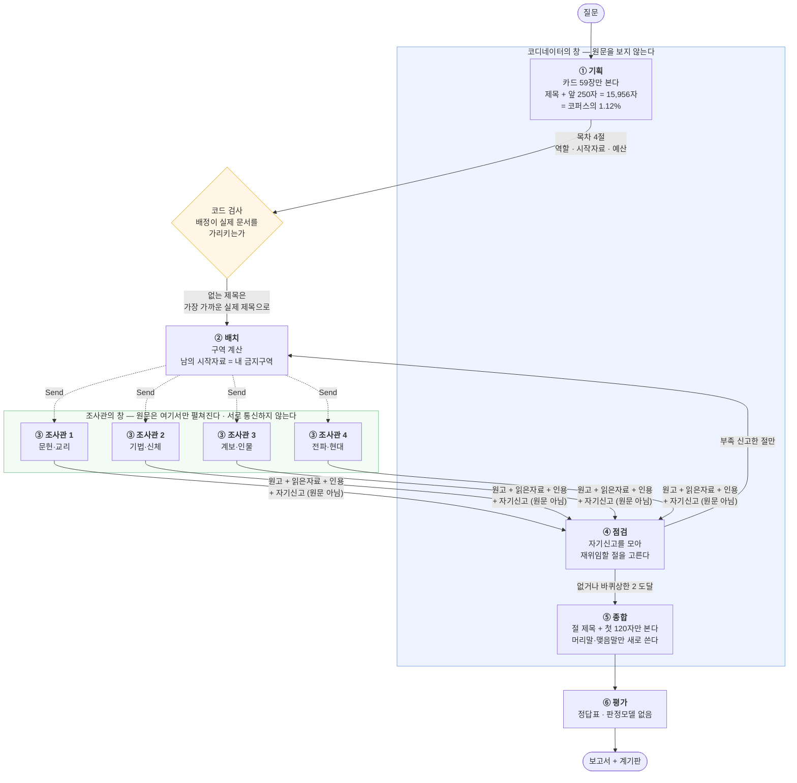
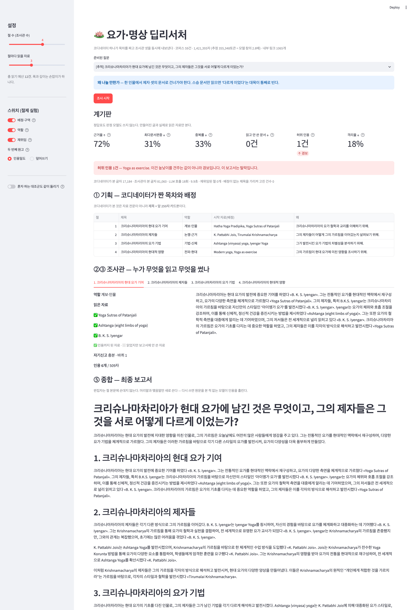

# 요가·명상 딥리서처 — 설계와 측정

모두의연구소 「에이전트 팀 꾸리기」 딥리서처 실습 프로젝트 · 2026-09-27
실행 기록 전부는 [`output/runs.jsonl`](output/runs.jsonl) · [`output/ablation.json`](output/ablation.json) ·
[`output/reports/`](output/reports/) 에 있다. 보고서 48편이 그대로 들어 있다.

---

## 1. 주제와 코퍼스

### 왜 요가·명상인가

내 일이 여기 있다. 소울매트에서 요가 매트를 팔고, 소울라이즈에서 요가·명상 행사를 열고,
요가 강사를 독자로 하는 책을 준비하고 있다. "호흡법 계보가 어디서 갈렸는지"를
한 장짜리로 정리해야 하는 일이 실제로 주기적으로 생긴다. 실습용으로 빌려 온 주제가 아니라
끝나고도 쓸 물건을 만들고 싶었다.

### 왜 한국어 위키가 아닌가

한국어 위키는 이 주제가 얇다. 「Tirumalai Krishnamacharya」·「Anapanasati」처럼
계보를 잇는 핵심 문서가 한두 문단뿐이라 절을 나눌 거리가 안 나온다.
그래서 **영어로 모으고 보고서는 한국어로 쓴다.** 조사관이 읽는 언어와 쓰는 언어가
다른 셈인데, 이게 뜻밖에 인용을 보기 쉽게 만든다 — 한국어 문장 끝에 «English Title» 이
붙으니 어느 문장이 자료에서 왔고 어느 문장이 모델의 연결어인지 **눈으로도** 구분된다.

### 나눌 이유가 있는가 — 숫자로

| | |
|---|---|
| 문서 | 영어 위키백과 **59건** (요가 철학 · 하타요가 · 불교 명상 · 근현대 · 호흡 5덩어리) |
| 총 글자 | **1,421,393자** · 문서 평균 24,091자 |
| 추정 토큰 | **355,348** (영어 4자 ≈ 1토큰) |
| 모델 창 | gpt-4o-mini · 128,000 |
| **비율** | **2.8배 — 한 창에 안 들어간다** |
| 내부 링크 | 1,065개 · 문서당 중앙값 16개 |

들어갔으면 그냥 다 넣으면 됐다. 안 들어가서 나눈다.
`fetch_corpus.py` 가 매번 이 비율을 찍고, 1.0배 아래면 "주제를 다시 잡아야 한다"고 말한다.

### 링크로 닿을 수 없는 자리

수집 결과 **「Lahiri Mahasaya」 는 들어오는 링크가 0개**였다. 코퍼스 안의 어떤 문서도
이 문서를 가리키지 않는다. 링크를 타는 탐색으로는 영원히 못 닿고,
**코디네이터의 배정만이 유일한 경로**다. 빼지 않고 남겨 두고, 이 문서가 없으면 답이 안 되는
질문(Q10)을 일부러 넣었다.

### 질문 10건 — 정답표 대신 "왜 나눌 만한가"

정답표는 만들지 않았다. 설정을 바꾸면 시스템이 다루는 범위가 달라지는데, 정답표를 그대로
두면 불공정하고 설정마다 새로 만들면 이미 같은 잣대가 아니기 때문이다.
대신 질문마다 왜 나눌 만한지를 한 줄로 적었다 ([`data/questions.json`](data/questions.json)).

| 유형 | 수 | 보기 |
|---|---|---|
| 단일 | 2 | Q1 우짜이 호흡 · Q2 부테이코 호흡법 |
| 분산 | 5 | Q3 요가의 호흡 기법들 · Q4 힌두/불교 호흡관찰 비교 |
| 추적 | 3 | Q8 크리슈나마차리아와 제자들 · Q10 크리야 요가 전승 |

**단일 유형을 일부러 둘 넣었다.** 한 건이면 끝날 질문에 조사관 넷을 띄우면 무슨 일이
생기는지 보이는 것도 이 프로젝트의 일부고, 한 번만 나쁜 건지 되풀이되는 건지 보려면
하나로는 모자란다.

---

## 2. 분업 설계

### 파이프라인 구조도



상태(State)와 리듀서 — `graph.py` 의 `class S`.

| 키 | 리듀서 | 누가 쓰는가 |
|---|---|---|
| `question` · `cfg` | (고정) | 입력 |
| `outline` · `zones` | 덮어쓰기 | ① 기획 → ② 배치 |
| `sections` | `operator.add` | ③ 조사관 넷이 **각자 하나씩 붙인다.** 재위임이 돌면 한 절에 원고가 둘 |
| `rounds` · `gaps` | 덮어쓰기 | ④ 점검 |
| `report` | 덮어쓰기 | ⑤ 종합 |
| `coord_chars` · `agent_chars` · `calls` | `operator.add` | **계량기.** 누가 몇 글자를 봤는지 각자 세고 합치는 것은 리듀서에 맡긴다 |
| `idx` · `절` · `남의구역` · `round` · `이미읽음` | (Send 전용) | 팬아웃이 조사관 한 명에게만 들려 보내는 짐 |

> **재위임 엣지를 노드 이름(`"조사관"`)으로 돌려줬더니** 팬아웃이 아니라 단일 진입이 되어,
> 조사관이 자기 절이 무엇인지 모른 채 `KeyError: '절'` 로 죽었다.
> **재위임도 `Send` 로 돌아가야 한다.**
>
> **2026-09-28 정정.** 여기 원래 함정을 둘로 적었다 — "Send 페이로드의 키가 상태 스키마에
> 없으면 LangGraph 가 조용히 버린다"를 첫 번째로 꼽았는데 **사실이 아니다.**
> 피어리뷰에서 [이정은](https://github.com/hey-byeunya) 님이 재현 스니펫을 물어 와 만들어 보다가 알았다.
> langgraph 1.2.11 은 스키마에 없는 Send 페이로드도 그대로 전달한다. `class S` 에서 그 다섯 줄을
> 지우고 돌려도 파이프라인은 멀쩡히 돈다(확인함). 당시 스키마에 키를 더한 뒤에도 **같은 자리에서
> 같은 에러**가 났는데, 그 '변화 없음'이 곧 "이 수정은 원인이 아니다"라는 증거였다.
> 나는 그걸 읽지 않고 고친 것을 원인으로 적었다. 함정은 하나였다.

### 서브에이전트 설계 규칙

**목차는 내용 단위로 가른다.** '개요·연표·분석' 같은 형식 단위로 나누면 네 명이 같은 자료를
읽는다. 프롬프트에 이 문장을 그대로 넣고, 절끼리 시작자료가 겹치지 않도록 요구했다.

**역할 명단 5개** (`config.json`) — 코디네이터가 절마다 하나를 고른다.

| 역할 | 지시 |
|---|---|
| 문헌·교리 | 경전과 개념이 원래 무엇을 뜻했는지, 어느 문헌에 어떻게 적혀 있는지를 좇는다 |
| 기법·신체 | 실제로 몸으로 무엇을 하는지, 절차와 신체적 작용을 좇는다 |
| 계보·인물 | 누가 누구에게 배웠고 무엇을 바꿨는지, 한 사람이 무엇에 관여했는지 좇는다 |
| 전파·현대 | 전통이 언제 어디로 옮겨 가 지금 어떤 모습이 되었는지 좇는다 |
| 논쟁·근거 | 주장에 대한 반론·연구 근거·불확실한 대목을 좇는다 |

**배정은 코드가 검사한다.** 모델은 그럴듯한 제목을 지어낸다. 실제로
「Krishnamacharya's Yoga Makaranda」처럼 **있을 법한데 코퍼스에 없는** 제목이 나온다.
`n_기획()` 이 모든 시작자료가 실제 문서인지 확인하고, 아니면 가장 가까운 실제 제목으로
바꾸고 **몇 건을 고쳤는지 센다**(`배정고침`). 조용히 넘기면 '배정했다'와 '배정이 닿았다'를
구별할 수 없다.

**구역** = 남의 시작자료. 조사관의 후보 목록에서 빠진다. 배정을 끄면 후보가 코퍼스 전체가 된다.

**격리는 숫자로 증명한다.** 원문은 `read_one()` 안에서만 펼쳐지고 조사관의 창에만 들어간다.
위로 올라가는 것은 원고·읽은자료 목록·인용·자기신고뿐이다. 모델에 넣기 직전에 글자를 세서
**격리율 = 코디네이터가 본 글자 ÷ 팀 전체가 본 글자**로 보인다. 측정값 **18.1%**
(코디네이터 17,184자 / 조사관 약 80,000자). 혼자 하는 대조군은 100%다.

**재위임**은 자기신고로만 연다. 바퀴 상한 2. 판단 기준을 "자료가 더 있으면 좋겠다"가 아니라
"핵심을 쓸 수 없었다"로 좁혔다 — 처음엔 넷이 매번 '부족'을 신고해 재위임이 늘 돌았다.

**두 번째 원고는 인용 밀도로 고른다.** 교안은 '마지막 것만 남긴다'로 정했다가 대가를 치렀다.
더 읽고 더 길게 썼는데 인용을 빠뜨린 원고가 멀쩡한 첫 원고를 지우는 일이 생긴다. 그래서
1,000자당 인용 수가 높은 쪽을 남기게 했다. `config.json` 의 `"두번째원고"` 를 `"덮어쓰기"` 로
바꾸면 교안과 같아지고, **그 차이도 절제 실험에서 쟀다**(§5).

또 하나 고쳤다. 재위임 바퀴에서 처음엔 새로 읽은 것만 보고 쓰게 했더니 두 번째 원고가
첫 원고의 내용을 통째로 잃었다. **이미 읽은 것도 다시 펴 놓고** 쓰게 했다.
`read_one()` 은 캐시에서 꺼내는 것이라 다시 읽는 데 호출도 돈도 들지 않는다.

**편집자는 절을 다시 쓰지 않는다.** 머리말·맺음말만 새로 쓴다. 다시 쓰면 문체는 매끄러워지지만
원문을 본 적 없는 모델이 «제목» 을 근거가 아니라 장식으로 옮긴다. 문체보다 인용을 택했다.
대가는 절끼리 문체가 들쭉날쭉하고 같은 사실이 두 절에 겹쳐 나온다는 것이고, 실제로 겹친다.

---

## 3. 지표 — 정답표도 판정 모델도 쓰지 않는다

[`metrics.py`](metrics.py) 는 **만들어진 글과 실제로 읽은 자료, 둘만** 본다.
질문을 바꿔도 코퍼스를 통째로 갈아 끼워도 설정을 어떻게 비틀어도 그대로 돈다.
절제 실험이 성립하는 조건이 그거다.

| 지표 | 한 줄 정의 | **어느 장치의 계기인가** | 방향 |
|---|---|---|---|
| 근거율 | 문장 중 «자료»가 붙은 비율 | 깊이 · 재위임 | ↑ |
| 최다문서편중 | 인용이 한 문서에 몰린 비율 | **배정 · 구역** | ↓ |
| 중복률 | 같은 문서를 여러 절이 겹쳐 읽은 비율 | **배정 · 구역** | ↓ |
| 읽고 안 쓴 문서 | 읽었는데 인용되지 않은 문서 수 | 배정 품질 | ↓ |
| 격리율 | 코디네이터가 본 글자 ÷ 팀 전체 | 컨텍스트 격리 | ↓ |
| **허위 인용** | 아무도 읽지 않은 것을 인용한 건수 | **계기가 아니라 경보** | **0** |

허위 인용만은 높낮이를 견주는 값이 아니다. 0이어야 하고, 0이 아니면 그 보고서는 탈락이다.
설명이 한 줄로 안 되는 지표는 넣지 않았다.

### 잣대 자체를 못 박은 곳 둘

**문장 분리 규칙은 한 곳에만 있고 바꾸지 않는다.** 처음 재니 근거율이 4.4%였다.
시스템이 나쁜 줄 알았는데 원인은 분리기였다 — 「B. K. S. Iyengar」가 마침표에서 세 문장으로
갈려 분모가 3배로 불었다. 마침표 앞이 홑 대문자면 쪼개지 않도록 고쳤더니 같은 시스템이
**77.4%** 로 찍혔다. 지표가 좋아진 줄 알았는데 분리 규칙이 바뀐 것 — 교안이 경고한 사고를
정확히 반대 방향으로 겪었다. `metrics.py` 의 `self_test()` 가 매번 이 규칙이 그대로인지
확인하고, 이니셜 사례를 못으로 박아 두었다.

**경보는 표기 변형에 울지 않는다.** 「Bhagavad Gītā」와 코퍼스의 「Bhagavad Gita」는 같은
문서인데 마크론 때문에 허위 인용으로 잡혔다. 경보가 헛울면 아무도 경보를 안 본다.
NFKD 로 발음기호를 접어 비교한다. 단, 「Ānāpānasati Sutta」는 「Anapanasati」와 **다른** 문서라
그대로 잡히는지도 자체 검증에 넣었다.

---

## 4. 혼자 하는 대조군 — 공정하게 맞췄는가

[`baseline.py`](baseline.py). 같은 코퍼스 · 같은 모델 · 같은 도구(`read_one`·후보목록) ·
**같은 읽기 예산 12건**. 다른 것은 하나뿐 — 나누지 않는다.

약한 상대를 만들지 않으려고 둘을 지켰다.

1. **예산을 끝까지 쓴다.** 모델이 후보에 없는 제목을 답해도 루프를 끊지 않고 가장 가까운 것
   (없으면 맨 앞)을 읽는다. 팀 쪽 조사관과 **똑같은 규칙**이다.
2. **읽기 한도도 같다.** 6,000자씩.

48회 전부에서 `읽은건수 = 12.0` 이었다. 예산을 다 썼다. 다 안 썼으면 코드가
"이 비교는 무효다"라고 찍는다.

---

## 5. 절제 실험 — 무엇이 실제로 값을 했는가

[`ablation.py`](ablation.py). 설정 6개 × 질문 4개(단일·분산·추적·추적) × 2회 = **48회**.
한 번에 하나만 껐다. 차이가 회차 편차보다 클 때만 '구분된다'고 쓴다
(판정은 공통 도구 `evalkit` 의 `distinguishable()`).

**같은 실험을 두 번 돌렸다.** 한 번으로는 방향을 말할 수 없기 때문이다. 아래 표는 2차이고,
1차는 [`output/ablation_1차.log`](output/ablation_1차.log) 에 그대로 있다.
**결론으로 쓴 것은 두 번 다 같은 방향으로 나온 것뿐이다.**

| 설정 | 근거율↑ | 편중↓ | 중복률↓ | 안쓴↓ | 허위0 | 인용↑ | 길이 | 호출↓ | 격리율↓ |
|---|---|---|---|---|---|---|---|---|---|
| **기본** | 69.5% | 27.1% | 21.9% | 2.2 | 1.1 | 24.5 | 3,042자 | 18 | 18.1% |
| 배정 끔 | 69.0% | **37.0%** | **56.2%** | 0.6 | 1.1 | 26.1 | 3,136자 | 18 | 17.3% |
| 역할 끔 | 70.2% | 25.8% | 16.7% | 3.2 | 0.6 | 26.8 | 3,230자 | 18 | 18.1% |
| 재위임 끔 | 73.1% | 25.1% | 20.9% | 2.4 | 0.8 | 26.4 | 3,066자 | 18 | 18.1% |
| 덮어쓰기 | 73.3% | 28.3% | 25.0% | 2.4 | 0.8 | 26.4 | 3,124자 | 18 | 18.0% |
| **혼자** | 68.9% | **42.8%** | 0.0% | **7.1** | 1.6 | 24.2 | **2,288자** | 13 | **100%** |

### 배정·구역 — 이것만 확실히 이긴다

두 번 다 같은 방향이었고 폭도 컸다.

| | 1차 | 2차 |
|---|---|---|
| 중복률 | 20.9% → **55.2%** | 21.9% → **56.2%** |
| 최다문서편중 | 25.0% → 40.3% | 27.1% → 37.0% |

껐더니 **네 조사관이 전원 「Pranayama」를 첫 자료로 골랐다.** 구역이 없으면 다들 가장
눈에 띄는 문서로 몰린다. 구조에서 가장 값싸고 가장 확실한 부분이 여기였다.

한 가지 교안과 달랐다. 교안은 배정을 끄면 **호출이 늘었다**고 했는데 우리는 18로 같았다.
이유가 분명하다 — 교안은 겹치는 선택을 코드가 걸러 내고 다시 고르게 하는데, 내 구현은
겹쳐도 그냥 읽는다. 그래서 겹치는 낭비는 나오되 되돌리는 낭비는 안 나온다.
**같은 결론이 아니라 다른 결론이고, 그 원인이 코드에 있다.**

> ⚠️ **지표 하나만 보면 거꾸로 읽는다.** 배정을 끄면 '읽고 안 쓴 문서'가 2.2 → 0.6 으로
> **좋아진다.** 나빠진 게 아니라, 다들 같은 문서 몇 건만 읽으니 안 읽힌 문서 자체가 없어진
> 것이다. 계기 하나로 판정하면 안 된다는 실례를 내 실험에서 직접 얻었다.

### 역할 — 이 표본으로는 방향을 말할 수 없다

1차는 편중이 나빠지고 중복이 좋아졌고, 2차는 안 쓴 문서가 늘고 허위가 줄었다.
**두 번의 방향이 서로 달랐다.** 반복해서 나온 건 '보고서가 조금 길어진다'(+237자 / +188자)
하나뿐인데, 길이는 방향이 정해진 계기가 아니다.

교안은 "역할은 질문이 역할을 요구할 때만 값을 한다"고 했다. 우리 네 질문은 모두
인물·계보·개념이 섞여 있어 어느 역할이든 비슷한 문서로 수렴한 것으로 보인다.
**"역할은 쓸모없다"가 아니라 "이 네 질문으로는 역할의 값을 보지 못했다"** 가 맞는 말이다.

### 재위임 — 값을 증명하지 못했다

가장 불편한 결과다. 2차에서는 **끈 쪽의 근거율이 3.6%p 더 높았다.** 1차에서는 편중이
1.8%p 나빠진 것 하나뿐이었다. 두 번을 합치면 재위임이 낫다고 말할 근거가 없다.

로그에서는 제일 바쁘게 일하는 장치다. 부족을 신고하고, 다시 나가고, 원고를 새로 올린다.
껐더니 나아졌다. **끄지 않았으면 영원히 몰랐을 것이다.**

### 두 번째 원고 규칙 — 1차엔 이겼고 2차엔 구분되지 않았다

내가 교안과 다르게 정한 부분이다. 1차에서는 '인용밀도'가 '덮어쓰기'보다 인용 1.9개 많고
보고서가 135자 길었다. **2차에서는 구분되는 지표가 하나도 없었다.**

그러니 결론은 "인용밀도가 낫다"가 아니라 **"이 표본으로는 두 규칙을 구분하지 못했다"** 이다.
그래도 인용밀도를 기본값으로 둔다. 구분되지 않으면 점수로 고르지 말고 **실패 양상**으로
고르는 게 맞고, 덮어쓰기의 실패 양상(인용 없는 원고가 멀쩡한 원고를 지움)이 더 나쁘다.

### 혼자 vs 팀 — 벌어지는 곳은 편중과 버린 예산

두 번 다 같은 방향으로 크게 벌어진 것 셋.

| | 팀 | 혼자 |
|---|---|---|
| 최다문서편중 | 27.1% | **42.8%** |
| 읽고 안 쓴 문서 | 2.2건 | **7.1건** |
| 보고서 길이 | 3,042자 | 2,288자 |

**혼자 하는 쪽은 12건을 읽고 5건만 쓴다.** 예산의 절반 이상을 버린다.
열두 건의 요약을 한 창에 쌓아 두고 보고서 전체를 쓰니, 창이 길어질수록 뒤쪽 자료가
흐려지고 또렷이 남은 몇 건으로 뭉뚱그리게 된다. 팀은 조사관 넷이 각자 자기 자료를
손에 쥔 채 자기 절을 쓴다.

근거율은 1차에 5.8%p 차이로 팀이 앞섰지만 2차에는 구분되지 않았다. **방향은 믿되 폭은 믿지 않는다.**

### 질문 유형별 — 이 구조를 쓰면 안 되는 경우

| | 유형 | 근거율 | 편중 | 안 쓴 문서 | 길이 |
|---|---|---|---|---|---|
| Q1 우짜이 호흡 | **단일** | 80.3% | 32.6% | **4.0건** | 2,498자 |
| Q4 힌두/불교 호흡관찰 | 분산 | 44.5% | 21.6% | 0.5건 | 3,112자 |
| Q8 크리슈나마차리아 계보 | 추적 | 71.0% | 23.8% | **0.0건** | 3,448자 |
| Q10 크리야 요가 전승 | 추적 | 82.0% | 30.3% | 4.5건 | 3,111자 |

**Q1 은 「Ujjayi」 한 건이면 답이 끝나는 질문이다.** 그런데 조사관 넷이 12건을 읽고
2,498자짜리 네 절 보고서를 낸다. 틀린 내용은 없다. 다만 읽고 싶은 글이 아니고,
한 명이 한 건 읽으면 될 일에 LLM 을 18번 불렀다.

중요한 건 **정답표 없이도 지표가 그걸 말해 준다**는 것이다. 편중이 높고 읽고 안 쓴 문서가
많으면 질문에 비해 과하게 분해했다는 신호다. 실제 서비스라면 질문을 받자마자
'이건 한 명이면 되겠다'를 판단하는 단계가 앞에 붙어야 하고, **그게 라우팅이다.**
딥리서처를 만들면서 밀어냈던 것이 마지막에 다시 필요해졌다.

---

## 6. 결과물을 직접 읽고 판단한다

지표는 명백한 실패를 거르는 그물이다. 그물을 통과했다고 좋은 보고서는 아니다.
[`output/reports/`](output/reports/) 의 48편 중 Q8(추적)을 설정별로 나란히 읽었다.

### 어느 쪽이 나은가 — 내 판단

**팀 쪽이 낫다.** 다만 이유는 숫자와 조금 다르다.

혼자 쓴 보고서([`혼자_Q8_r1.md`](output/reports/혼자_Q8_r1.md))는 읽기에는 오히려
깔끔하다. 문체가 하나고, '기여 → 제자들의 해석 → 현대 요가의 다양성 → 결론' 으로
흐름이 매끄럽다. 팀 보고서는 절마다 리듬이 다르고 같은 사실이 두 절에 겹쳐 나온다.
**매끄러움만 보면 혼자 쪽이 낫다.**

그런데 내용을 보면 뒤집힌다. 혼자 쪽은 네 절 내내 Iyengar 와 Jois 둘 이야기만 하고,
크리슈나마차리아 본인의 방법론(비니요가·비냐사 크라마)은 한 문단에 뭉뚱그려진다.
12건을 읽고 5건만 인용했으니 나머지 7건에서 읽은 것은 어디에도 안 들어갔다.
팀 쪽은 「Ashtanga (vinyasa) yoga」에서 tristhana(호흡·자세·시선) 같은
**질문에 실제로 답하는 구체**를 가져온다. 내가 요가 강사용 원고에 쓰려고 이 보고서를
받았다면, 혼자 쪽은 다시 시켜야 하고 팀 쪽은 고쳐서 쓸 수 있다.

### 마음에 안 드는 대목 — 어느 절, 어느 자료에서 왔나

[`기본_Q8_r1.md`](output/reports/기본_Q8_r1.md) 의 **절 제목이 「1. Tirumalai Krishnamacharya」
「2. Yoga as exercise」** 다. 코디네이터가 목차를 **내용 단위가 아니라 자료 단위로** 갈랐다.
프롬프트에 "내용 단위로 가르라"고 써 두었는데도 문서 제목을 그대로 절 제목으로 쓴 것이다.
같은 질문을 배정 끔으로 돌린 [`배정끔_Q8_r1.md`](output/reports/배정끔_Q8_r1.md) 는
「크리슈나마차리아의 현대 요가 기여」처럼 더 나은 제목을 붙였다 — **시작자료를 주는 것이
목차를 자료 쪽으로 끌어당기는** 부작용이 있다. 배정의 값어치가 워낙 커서 끄지는 않았지만,
기획 프롬프트에서 목차와 배정을 두 단계로 떼는 편이 나았을 것이다.

### 인용을 원문과 대조했다 — 지표가 못 잡는 것

[`기본_Q8_r1.md`](output/reports/기본_Q8_r1.md) 1절에 이런 문장이 있다.

> **Iyengar의 제자들은** 그의 가르침을 바탕으로 각기 다른 방식으로 요가를 발전시켰으며,
> Pattabhi Jois는 Ashtanga Yoga를 창안하여 또 다른 방향으로 나아갔다 «Iyengar Yoga».

원문(`data/corpus.json` → `Iyengar Yoga`)은 이렇게 적혀 있다.

> B. K. S. Iyengar learnt yoga from Tirumalai Krishnamacharya at the Mysore Palace,
> **as did Pattabhi Jois**; Iyengar Yoga and Jois's Ashtanga (vinyasa) yoga are thus
> **branches of the same yoga lineage**.

**Jois 는 Iyengar 의 제자가 아니라 같은 스승 밑의 동문이다.** 원문에 정확히 그렇게
적혀 있는데 보고서가 사제 관계로 바꿔 놓았다. 그런데 인용은 붙어 있고 그 문서를 읽기도 했다.
**근거율도 허위 인용도 통과한다.** 읽어야만 보인다.

Q8 이 하필 "제자들은 서로 어떻게 다르게 이었는가"를 묻는 질문이라, 이 오류는 보고서의
주제를 정면으로 틀리게 만든다. **자동 지표로 걸러 낸 뒤에도 사람이 읽어야 하는 이유가 이거다.**

### 허위 인용 — 경보가 실제로 울렸다

1차 48회에서 37건이 울렸다. 뜯어보니 세 종류였다.

| 종류 | 예 | 성격 |
|---|---|---|
| ① 아무도 안 읽은 **코퍼스 문서**를 인용 | `Yoga as exercise` 13회 · `Yoga Sutras of Patanjali` 8회 | 진짜 허위. 모델이 아는 걸 읽은 척했다 |
| ② 코퍼스에 없는 **책 제목**을 인용 | `Light on Yoga` · `Yoga Makaranda` · `Yoga Rahasya` | 본문에 나온 문헌명을 «»로 감쌌다 |
| ③ **표기 변형** | `Bhagavad Gītā` vs 코퍼스의 `Bhagavad Gita` | 잣대 쪽 결함 — 고쳤다(§3) |

③만 고치고 ①②는 남겨 두었다. **이건 시스템의 실제 결함이고, 경보가 제 일을 한 것이다.**
2차에서도 기본 설정 기준 질문당 평균 1.1건이 남아 있다. Q4·Q10 에 몰려 있고 Q8 은 거의 0이다.

---

## 7. 데모 설계

```bash
.venv/bin/streamlit run app.py
```



숫자만 보여 주는 화면은 이 프로젝트의 요점을 놓친다. 이 구조의 값어치는 '답이 맞았나'가
아니라 '어떻게 나눠서 그 답에 닿았나'에 있다. 그래서 네 가지를 화면에 올렸다.

**① 계기판을 먼저 놓고, 경보를 색으로 구분했다.** 다섯 개 신호는 값만 보여 주고,
허위 인용만 0이 아니면 빨간 띠로 "이 보고서는 탈락입니다"라고 쓴다.
캡처에 실제로 그 띠가 떠 있다 — 잘 되는 장면만 찍지 않았다.

**② 코디네이터가 짠 목차와 배정을 표로 펼쳤다.** 절마다 역할·시작자료·왜 그렇게 갈랐는지.
분업이 어떻게 결정됐는지가 결과물보다 먼저 보여야 한다고 봤다.

**③ 조사관별 탭에서 읽은 자료에 ✅/⬜ 를 붙였다.** ✅ 는 인용까지 된 자료, ⬜ 는 읽었지만
보고서에 안 쓴 자료다. '읽고 안 쓴 문서'라는 지표가 **화면에서 눈으로 세어진다.**
자기신고와 바퀴 수도 같이 보여 준다.

**④ 스위치를 사이드바에 그대로 올렸다.** 배정·역할·재위임을 끄고 같은 질문을 다시 돌려
숫자가 어떻게 움직이는지 직접 볼 수 있다. '혼자 하는 대조군도 같이 돌리기'를 켜면
두 보고서가 좌우로 나란히 뜨고, 대조군이 예산을 다 안 썼으면 "이 비교는 무효다"라고 경고한다.

맨 아래 **'원문과 대조해 보기'** 는 인용이 제자리에 붙었는지 사람이 직접 확인하라는 자리다.
§6 의 오귀속을 내가 찾은 곳이 여기다.

> 캡처는 `docs/capture.py` 가 크롬을 디버깅 포트로 띄우고 **보고서 글자가 실제로
> 나타난 것을 확인한 뒤** 찍는다. 헤드리스 크롬의 `--screenshot` 은 Streamlit 에 못 쓴다
> (WebSocket 으로 그리는데 가상 시간만 돌고 실제 응답을 안 기다려서 로딩 뼈대가 찍힌다).
> `captureBeyondViewport` 로 찍었더니 고정 위치인 사이드바가 왼쪽으로 밀려 잘려서,
> 창 자체를 높게 띄우고 뷰포트 그대로 찍는 방식으로 바꿨다.

---

## 8. 회고

### 가장 공들인 것 — 잣대를 먼저 믿을 수 있게 만든 일

근거율 4.4%를 보고 시스템을 고치러 갈 뻔했다. 원인은 문장 분리기였다.
그 한 번 때문에 방침을 정했다. **지표를 고칠 때마다 자체 검증에 사례를 못으로 박는다.**
`metrics.py` 의 `self_test()` 는 이제 이니셜이 든 문장, 표기 변형, 표기 변형이 아닌 것까지
확인하고 나서야 통과한다. 검사기가 깨져 있어도 0은 나온다 — 비밀값 검사 스크립트를 만들며
배운 것이 여기서 또 쓰였다.

같은 이유로 **같은 실험을 두 번 돌렸다.** 1차만 봤으면 "인용밀도 규칙이 덮어쓰기를 이긴다",
"역할을 끄면 편중이 나빠진다" 두 가지를 결론으로 썼을 것이다. 2차에서 둘 다 사라졌다.
**차이가 편차보다 큰지 먼저 보는 것**, 그것 하나가 이 프로젝트에서 제일 값을 했다.

### 다음에 보완할 것

**하나만 고른다면 — 인용 오귀속을 잡는 장치.** 지금은 '읽지 않은 문서를 인용했나'만 본다.
읽은 문서를 엉뚱한 문장에 갖다 붙인 것은 사람만 잡고, §6 에서 보듯 그게 보고서 주제를
통째로 틀리게 만들 수 있다. 판정 모델을 쓰지 않고 잡는 방법이 하나 있다 —
인용된 문서 본문에서 그 문장의 고유명사·숫자가 실제로 함께 등장하는지를 대조하는 것.
정답표가 없어도 되고 결정적이다. 다음 바퀴에 이걸 만든다.

그 밖에.

- **기획을 두 단계로 뗀다.** 목차를 먼저 짜게 하고, 그다음에 절마다 자료를 배정한다.
  지금은 한 번에 시켜서 목차가 문서 제목 쪽으로 끌려간다(§6).
- **질문 앞단에 라우팅을 붙인다.** Q1 같은 단일 질문은 한 명에게 보낸다. 지표가 이미
  그 신호(편중↑ · 안 쓴 문서↑)를 주고 있으니 판정 기준을 만들 재료는 있다.
- **역할을 제대로 재려면 질문을 다시 짜야 한다.** 지금 네 질문은 어느 역할이든 비슷한 문서로
  수렴한다. 역할이 갈릴 수밖에 없는 질문 — 예컨대 "이 수행법의 효과에 대한 반론은 무엇인가"
  같은 논쟁형 — 을 넣어야 '논쟁·근거' 역할의 값을 볼 수 있다.
- **배정이 겹쳤을 때 되돌리는 경로가 없다.** 교안은 겹치면 다시 고르게 한다. 그래서 교안에서는
  배정을 끄면 호출이 늘고 우리는 안 는다(§5). 넣으면 겹침 자체가 줄겠지만 호출이 늘 텐데,
  어느 쪽이 나은지는 재 봐야 안다.

### 마지막으로

이 구조가 늘 옳지 않다는 걸 프로젝트 안에서 증명하게 질문을 짠 것이 잘한 선택이었다.
Q1 한 줄이 "나누지 마라"고 말해 준다. 만든 사람이 만든 것을 자랑하는 보고서가 아니라,
**언제 쓰고 언제 쓰지 말아야 하는지**를 숫자로 말하는 보고서가 되었다고 본다.
